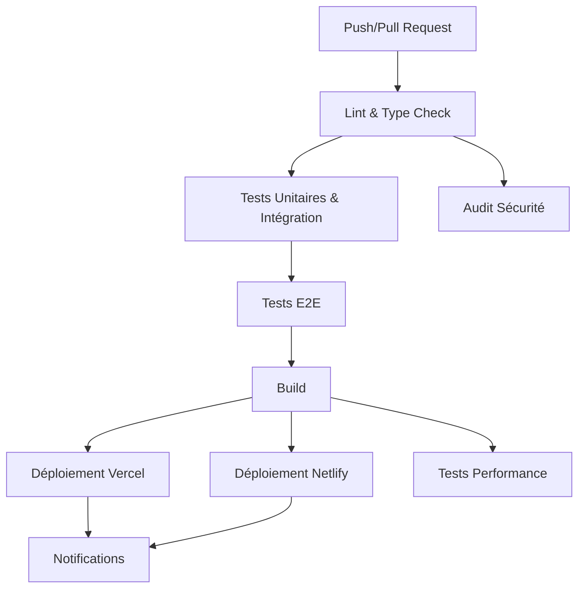

# 🚀 CI/CD Pipeline - Harmonia

Ce document décrit le pipeline CI/CD automatisé pour le projet Harmonia, configuré avec GitHub Actions.

## 📋 Vue d'ensemble

Le pipeline CI/CD comprend les étapes suivantes :

1. **Lint & Type Check** - Vérification de la qualité du code
2. **Tests Unitaires & Intégration** - Tests automatisés
3. **Tests E2E** - Tests de bout en bout avec Playwright
4. **Build** - Construction de l'application
5. **Déploiement** - Déploiement sur Vercel/Netlify
6. **Notifications** - Alertes Slack/Email
7. **Sécurité** - Audit de sécurité
8. **Performance** - Tests de performance

## 🔄 Workflow



## 🛠️ Configuration

### Prérequis

- Repository GitHub
- Compte Vercel (recommandé) ou Netlify
- Compte Slack (optionnel pour les notifications)

### Installation

1. **Cloner le repository**

   ```bash
   git clone https://github.com/votre-username/harmonia.git
   cd harmonia
   ```

2. **Installer les dépendances**

   ```bash
   npm install
   ```

3. **Configurer les secrets GitHub**

   ```bash
   npm run validate:secrets
   ```

4. **Suivre les instructions de configuration**
   - Voir [docs/GITHUB_ACTIONS_SETUP.md](docs/GITHUB_ACTIONS_SETUP.md)

## 🚀 Utilisation

### Déclenchement automatique

Le pipeline se déclenche automatiquement sur :

- **Push** sur les branches `main` et `develop`
- **Pull Request** vers les branches `main` et `develop`

### Déclenchement manuel

1. Allez sur l'onglet **Actions** de votre repository GitHub
2. Sélectionnez le workflow **CI/CD Pipeline**
3. Cliquez sur **Run workflow**
4. Choisissez la branche et cliquez sur **Run workflow**

### Validation locale

Avant de pousser votre code, validez localement :

```bash
# Validation complète
npm run ci:validate

# Validation des secrets uniquement
npm run validate:secrets

# Tests uniquement
npm run test:all

# Lint uniquement
npm run lint
```

## 📊 Monitoring

### Statuts des jobs

- ✅ **Succès** - Toutes les étapes sont passées
- ❌ **Échec** - Une ou plusieurs étapes ont échoué
- ⏳ **En cours** - Le pipeline est en cours d'exécution
- ⏸️ **En attente** - En attente d'approbation (environnements protégés)

### Artifacts générés

- **Build files** - Fichiers de build (7 jours de rétention)
- **Playwright report** - Rapports de tests E2E (30 jours)
- **Performance report** - Rapports de performance (30 jours)
- **Coverage** - Couverture de code (via Codecov)

### Notifications

#### Slack

- **Canal** : `#deployments`
- **Événements** : Succès et échecs de déploiement
- **Informations** : Branche, commit, auteur, URL

#### Email (optionnel)

- **Événements** : Échecs de déploiement uniquement
- **Configuration** : Via webhook personnalisé

## 🔧 Personnalisation

### Modifier les branches déclencheuses

Éditez `.github/workflows/deploy.yml` :

```yaml
on:
  push:
    branches: [main, develop, staging] # Ajoutez vos branches
  pull_request:
    branches: [main, develop]
```

### Ajouter des environnements

1. Créez un fichier dans `.github/environments/`
2. Configurez les règles de protection
3. Ajoutez les variables d'environnement

### Modifier les notifications

Personnalisez les messages dans les jobs `notify-failure` et `notify-success`.

## 🛡️ Sécurité

### Environnements protégés

- **Production** : Approbation requise, timer de 5 minutes
- **Staging** : Pas d'approbation, timer de 2 minutes

### Audit de sécurité

Le pipeline inclut :

- Audit des dépendances (`npm audit`)
- Tests de sécurité personnalisés
- Validation CSP (Content Security Policy)
- Validation CORS

### Secrets

- Tous les secrets sont stockés dans GitHub Secrets
- Aucun secret n'est exposé dans le code
- Rotation régulière des tokens recommandée

## 📈 Performance

### Métriques surveillées

- Temps de build
- Taille des bundles
- Temps de chargement
- Core Web Vitals

### Optimisations

- Cache des dépendances npm
- Cache des builds Vercel/Netlify
- Compression des assets
- Minification du code

## 🐛 Dépannage

### Erreurs courantes

1. **Secrets manquants**

   ```bash
   npm run validate:secrets
   ```

2. **Tests qui échouent**

   ```bash
   npm run test:all
   ```

3. **Build qui échoue**

   ```bash
   npm run build
   ```

4. **Déploiement qui échoue**
   - Vérifiez les tokens Vercel/Netlify
   - Consultez les logs de déploiement

### Logs et debugging

- **GitHub Actions** : Onglet Actions du repository
- **Vercel** : Dashboard Vercel > Deployments
- **Netlify** : Dashboard Netlify > Deploys

### Support

- Consultez [docs/GITHUB_ACTIONS_SETUP.md](docs/GITHUB_ACTIONS_SETUP.md)
- Vérifiez les [logs GitHub Actions](https://docs.github.com/en/actions/monitoring-and-logging)
- Contactez l'équipe de développement

## 📚 Ressources

- [GitHub Actions Documentation](https://docs.github.com/en/actions)
- [Vercel Documentation](https://vercel.com/docs)
- [Netlify Documentation](https://docs.netlify.com/)
- [Playwright Documentation](https://playwright.dev/)
- [Vitest Documentation](https://vitest.dev/)

## 🔄 Mise à jour

Pour mettre à jour le pipeline :

1. Modifiez `.github/workflows/deploy.yml`
2. Testez localement avec `npm run ci:validate`
3. Faites un commit et push
4. Surveillez l'exécution dans GitHub Actions

---

**Note** : Ce pipeline est configuré pour un projet Astro avec Supabase, Vercel/Netlify, et des tests complets. Adaptez-le selon vos besoins spécifiques.
